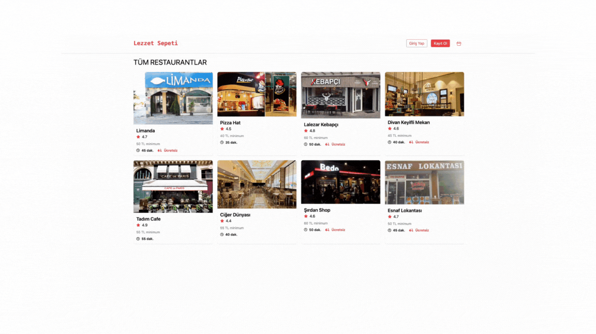

## Thunk-Sepeti

- Bu proje, kullanıcıların yemek siparişi vermesine olanak tanıyan bir web uygulamasını temsil eder. Yemekleri seçebilir ve sipariş verebilirler.Yemek menüsünü yönetebilir, siparişleri görüntüleyebilir ve menüden yemek seçip sepete ekleyebilir, sepetlerini görüntüleyebilir.düzenleyebilir ve silebilirler.

## Kütüphaneler
react-router-dom
json-server
axios
redux
react-redux
redux-thunk
tailwind
react-icons
Package.json
"server": "json-server --watch db.json --port 3003"

# Thunk-Sepeti
